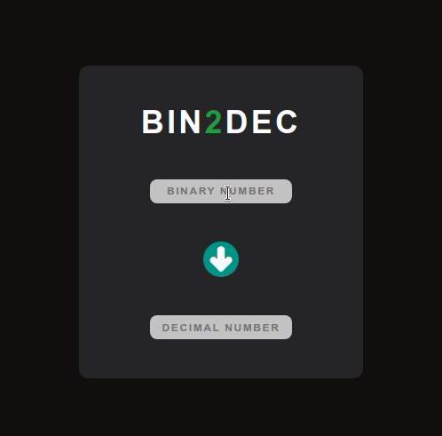

<h1 align="center">1️⃣ Bin-2-Dec 0️⃣ </h1>

<p align="center">
  <a href="#-projeto">Projeto</a>&nbsp;&nbsp;&nbsp;|&nbsp;&nbsp;&nbsp;
  <a href="#%EF%B8%8F-tecnologias">Tecnologias</a>&nbsp;&nbsp;&nbsp;|&nbsp;&nbsp;&nbsp;
  <a href="#--funcionalidades">Funcionalidades</a>&nbsp;&nbsp;&nbsp;|&nbsp;&nbsp;&nbsp;
  <a href="#%EF%B8%8F--autor">Autor</a>&nbsp;&nbsp;&nbsp;|&nbsp;&nbsp;&nbsp;
  <a href="#-licen%C3%A7a">Licença</a>
</p>

</br>

<p align="center">
  
</p>

</br>

## 💡 Projeto

<p>Um conversor de números binários para números decimais.</p>

</br>

### 🚜 Como rodar o projeto?

```bash
# Clone o repositório
git clone https://github.com/Gabriek0/bin-2-dec.git

# Entre no diretório do projeto
cd bin-2-dec

# Instale as dependencias
npm install

# Rode o projeto
npm start

```

## ⚙️ Tecnologias

- [Javascript](https://developer.mozilla.org/pt-BR/docs/Web/JavaScript)
- [CSS](https://developer.mozilla.org/pt-BR/docs/Web/CSS)
- [HTML](https://developer.mozilla.org/pt-BR/docs/Web/HTML)
- [React](https://pt-br.reactjs.org/)


  </br>

## 🔨 Funcionalidades

- [x] O usuário pode incluir seu CPF em dois campos: o primeiro é o campo de _CPF_ e o outro o de _confirmação de CPF_, se o CPF for válido o **CPF Validaton** irá informar.

</br>

## ✒️ Autor

</br>

👤 **Gabriel Henrique**

- Github: [@Gabriek0](https://github.com/Gabriek0)
- LinkedIn: [@gabriel-henrique-664bb219a](https://www.linkedin.com/in/gabriel-henrique-664bb219a/)

</br>

## 📜 Licença

- []()
