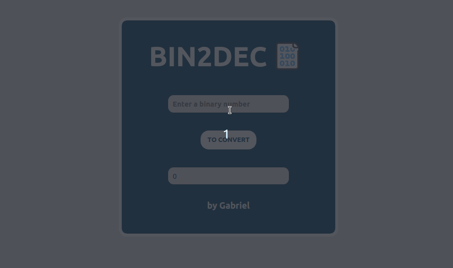

<h1 align="center">Bin2Dec 🖥️</h1>
<h1 align="center">
  
</h1>
Converte um número binário em decimal
---
## Funcionalidades
- [x] O usuário pode inserir até 8 dígitos binários em um campo de entrada
- [x] O usuário deve ser notificado se algo diferente de 0 ou 1 for inserido
- [x] O usuário visualiza os resultados em um único campo de saída contendo o equivalente decimal (base 10) do número binário que foi inserido
## Autor
:bust_in_silhouette: Gabriel Henrique
- Twitter: [@GabrewHenrique](https://twitter.com/GabrewHenrique)
- Github: [@Gabriek0](https://github.com/Gabriek0)
- LinkedIn: [gabriel-henrique](https://www.linkedin.com/in/gabriel-henrique-664bb219a/)
---